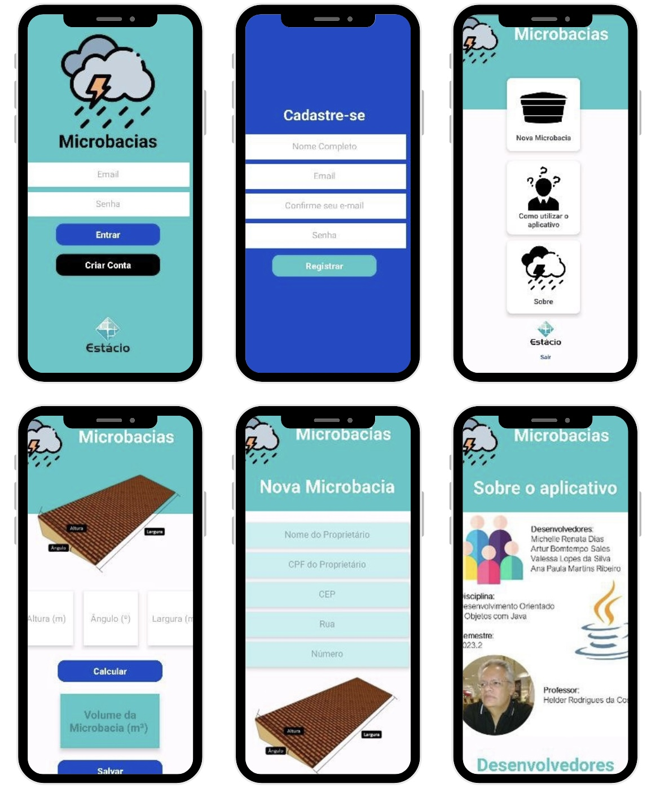

# Aplicativo de Microbacias 

## Bancos de Dados Utilizados:
 O projeto utiliza o Firebase como banco de dados. O Firebase é uma plataforma de desenvolvimento de aplicativos móveis e web que fornece uma variedade de serviços, incluindo armazenamento em tempo real e banco de dados em nuvem.

## IDE Android Studio: 
O desenvolvimento do projeto é feito na IDE Android Studio. O Android Studio é o ambiente de desenvolvimento oficial para aplicativos Android, oferecendo ferramentas avançadas para criar, testar e depurar aplicativos.

## Linguagem de Programação Java: 
O código do projeto é escrito em Java, uma linguagem de programação amplamente utilizada para o desenvolvimento de aplicativos Android. Java é conhecida por sua portabilidade, segurança e robustez.

## Projeto de Extensão da Faculdade: 
É um projeto de extensão da faculdade, que faz parte de atividades extracurriculares e de pesquisa desenvolvidas em colaboração com a instituição acadêmica.

## Projeto Mobile: 
O projeto é voltado para o desenvolvimento de um aplicativo móvel, 

## Divisão em Telas:

    

1. Login/Cadastro: Uma tela onde os usuários podem fazer login ou se cadastrar no aplicativo.
2. Cadastrar Nova Microbacia: Tela para cadastrar novas microbacias, com campos para informações relevantes sobre a microbacia.
3. Calcular Área do Telhado: Uma tela para calcular a área do telhado para achar o volume da Microbacia ideal, relacionada à gestão de recursos hídricos.
4. Tutorial do Aplicativo: Uma tela que fornece um tutorial sobre como usar o aplicativo.
5. Sobre os Desenvolvedores: Uma tela com informações sobre os desenvolvedores do aplicativo, que inclui nomes, fotos e biografias.

## Tecnologias:

